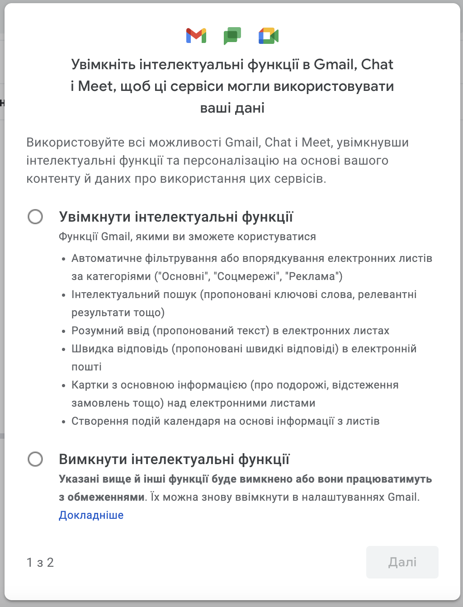

# Акаунт в Google
Для створення облікового запису в Gmail (якщо його немає) перейдіть за посиланням:  
https://www.google.com/intl/uk/gmail/about/  
  
  
  
  
  
  
  
  
  
  
  
  
  
  

## Google-календар, Google-meet
Для переходу до календаря ви можете скористатися посиланням https://calendar.google.com/ або натиснути на кнопку календаря в переліку Google-додатків.
  

Перед вами відкриється поле часу за весь тиждень. Для додавання нової події натисніть на час да день тижня, який вам потрібен (на прикладі - понеділок 15:30) (**1**).
У вікні події, що з'явиться впишіть назву події (**2**), якщо подія триває не годину, ви це можете змінити в (**3**), для запрошення учасників додайте їх email-адреси (із акаунтами Google) (**4**), та натисніть "**Зберегти**" (**5**)
  
  
  
  
  
  
  
  
  
  
  
  

