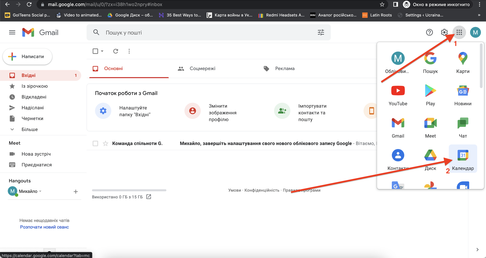
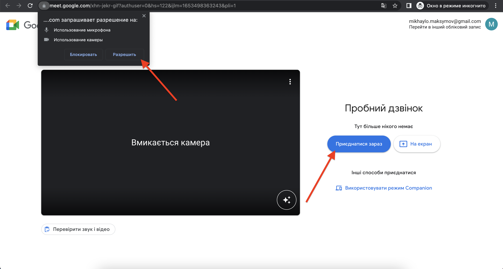
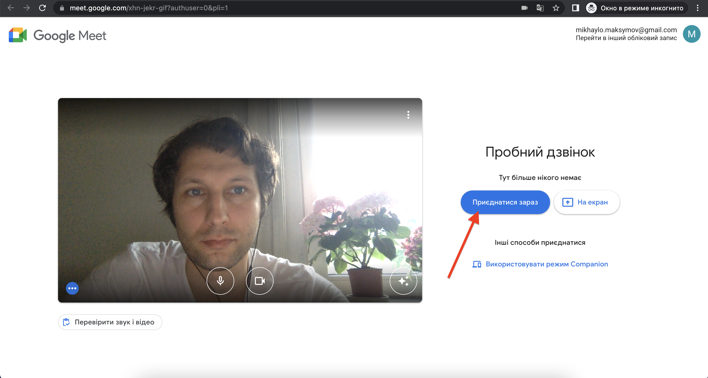
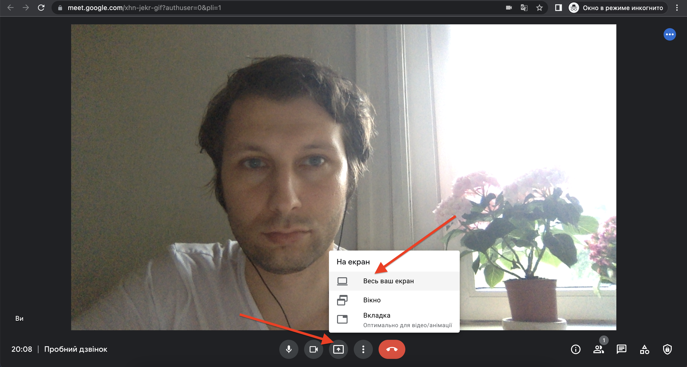
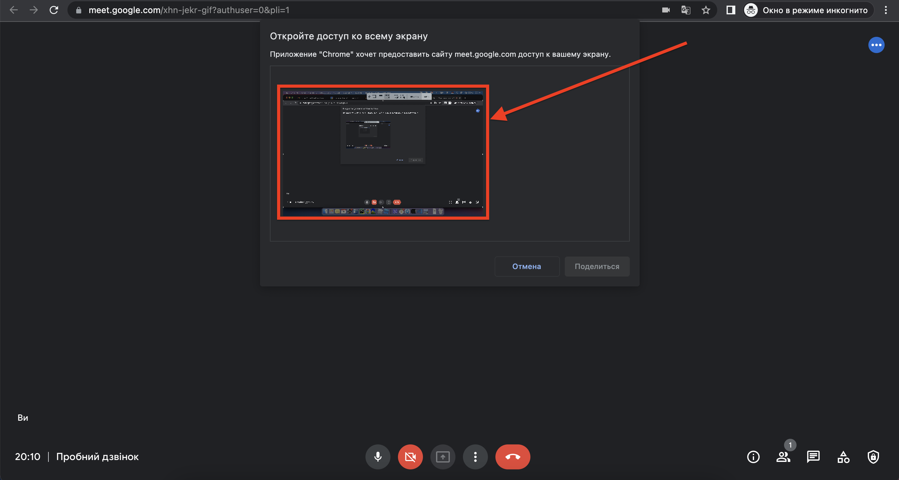
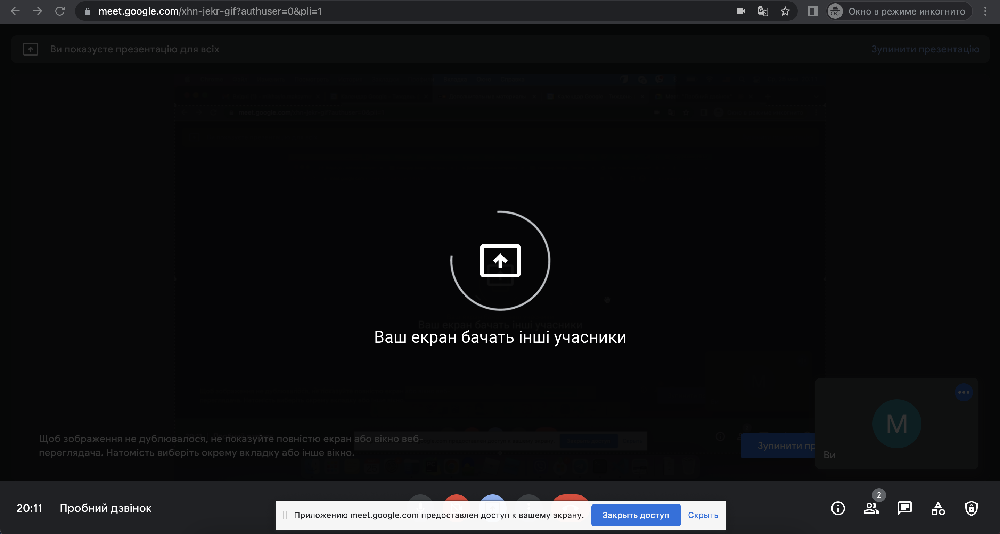

# Календар та Google-meet
В обілковому запису оберіть в розділ "Календар"
  

У полі із датами (поточний тиждень) натисніть на бажаний час бажаної дати (**1**) - в прикладі це 15:30 в неділю. У вікні, що відкриється введіть назву події (**2**) - в прикладі "Пробний дзвінок". Якщо необхідно, скорегуйте час проведення заходу (**3**) - в прикладі та за замовчуванням тривалість заходу - 1 година. Додайте учасників, вказавши їх електронні поштові адреси, що є акаутнами Google (**4**). По завершенню всії необхідних дій, натисніть кнопку "Зберегти" (**5**)
  
  
  
  
  
  
  
  
  
  
  
  
