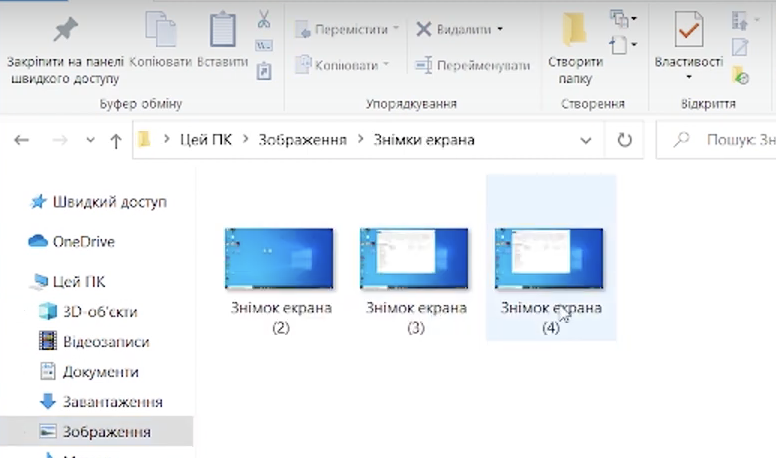
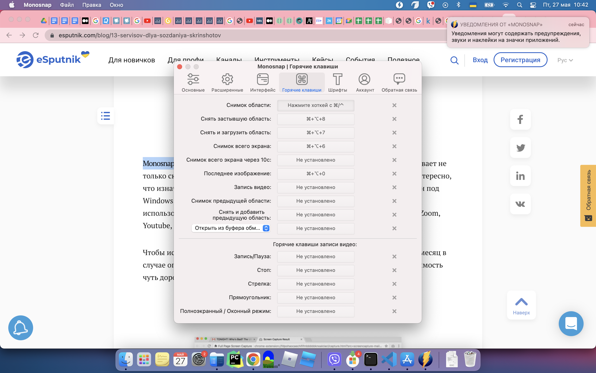
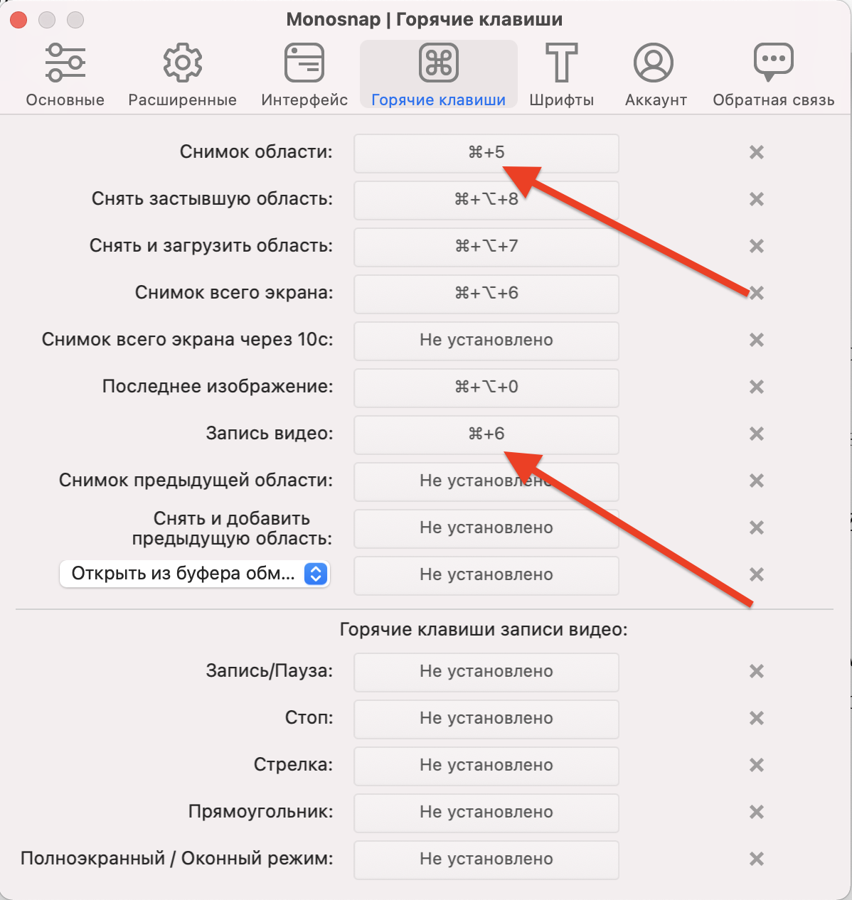
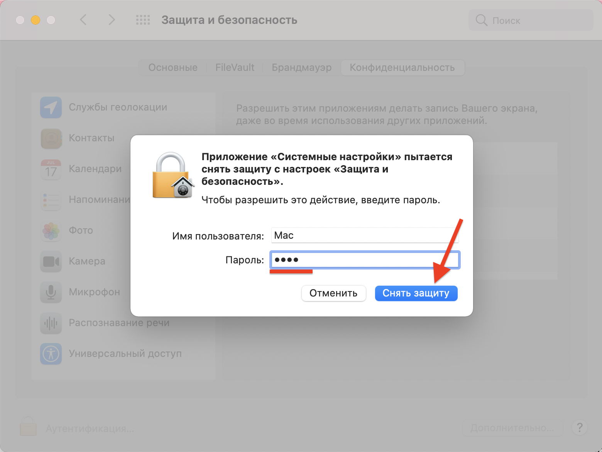
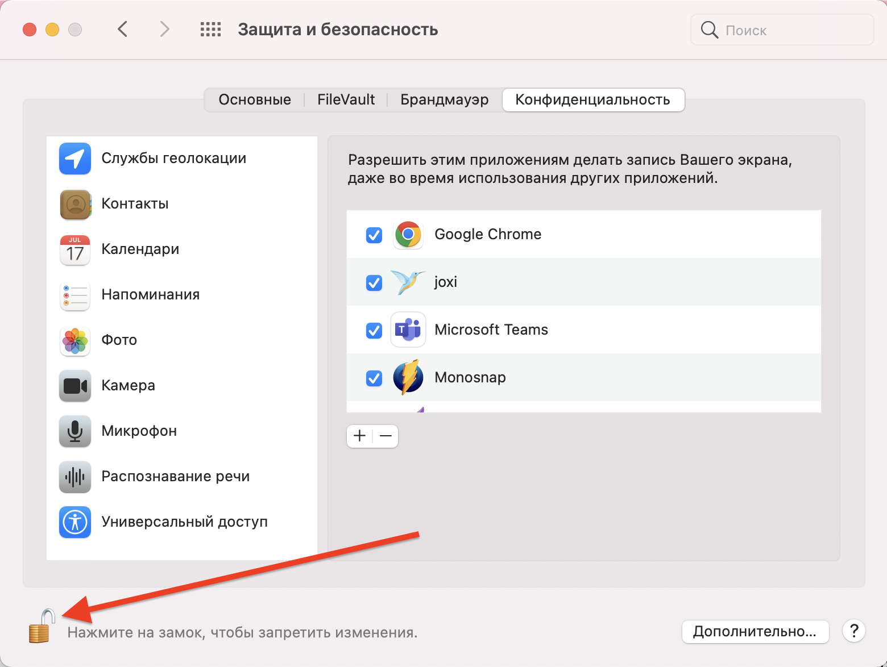
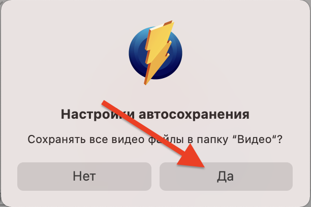
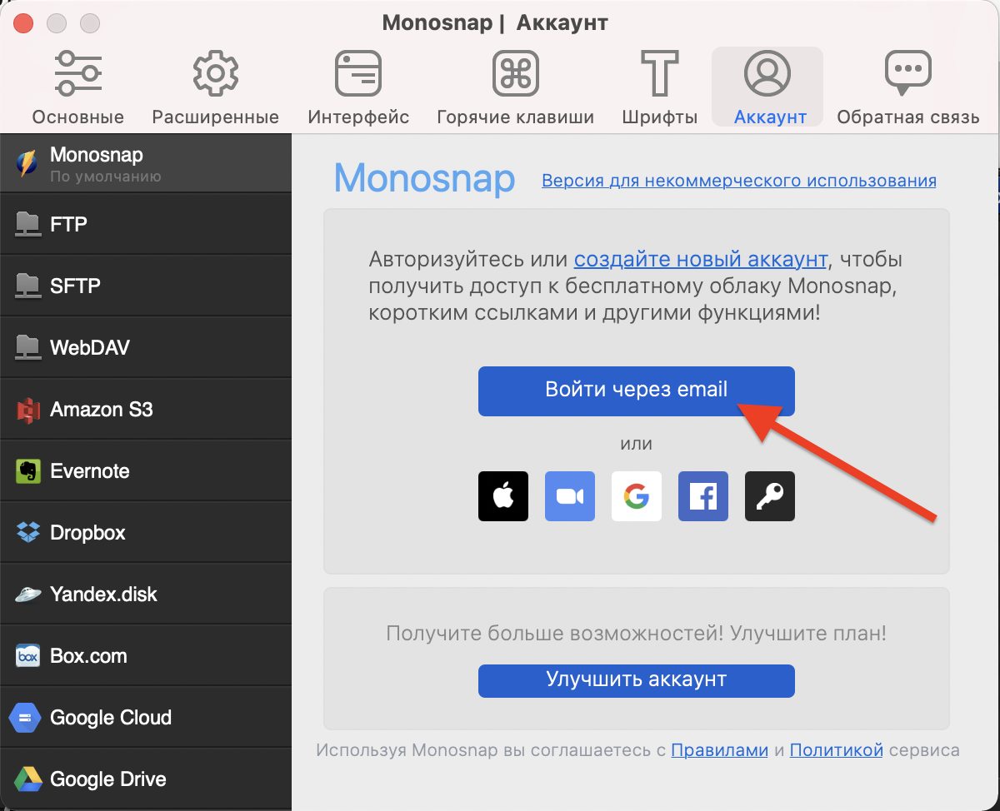
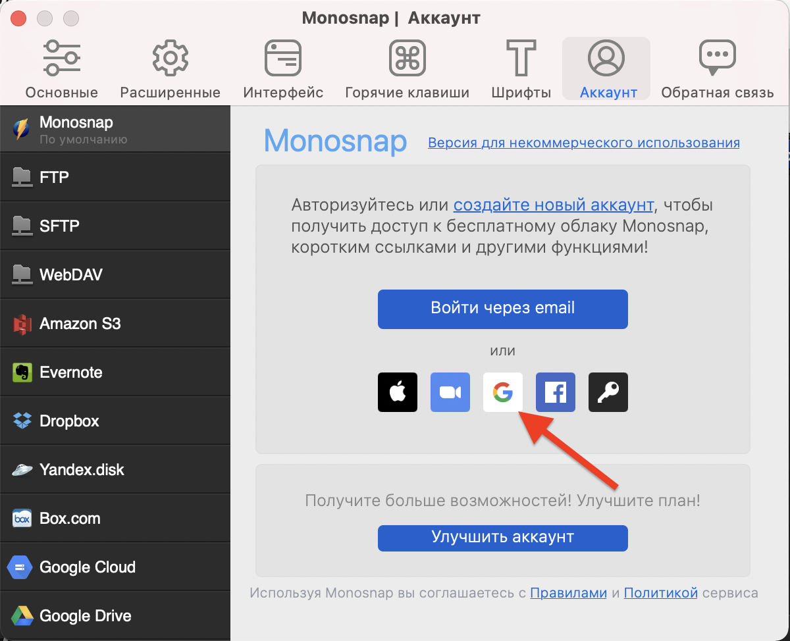

# Скріншот
В кожній операційній системі є вбудовані засоби створення скріншотів.
в Windows - це кнопка **PrntScr**, при її натисканні 

  
  
Для створення скріншотів скористайтесь програмами:
- lightshoot
- monosnap

**Для Mac:**
  
  
  
  
  
  
  
  
  
  
  
  
  
  
  
  
  
  

