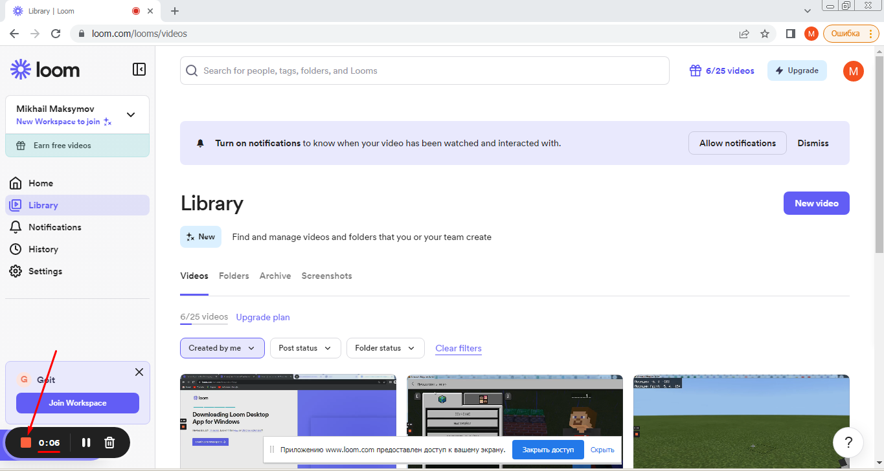

# Зйомка відео з екрану (скрінкаст)  
Для того, щоб зняти відео із власного екрану необхідно використовувать спеціальну програму, або сервіс.  Можна використовувати програми <a href = "https://zoom.us/download">Zoom</a>, <a href="https://monosnap.com/download/">Monosnap</a> або <a href = "https://mathewsachin.github.io/Captura/">Captura</a>.    
Проте ми рекомендуємо використовувати сервіс <a href = "https://www.loom.com/">loom</a> через те, що, з одного боку, налоштовувати його дуже зручне, а з іншого він дозволяє зберігати до 25 відео на самому сервісі.  
  
## Реєстрація аккаунту на Loom  
Зайдемо на сайт <a href = "https://www.loom.com/">loom.com</a> та натиснемо кнопку **Sign up for free**.  
   
Найзручнішою формою для реєстрації є реєстрація через обліковий запис Google   
    
    
   
  
## Запишемо відео з екрану   
Натиснемо на кнопку **New video**    
    
  
Оберемо пункт "Записати відео" (**Record video**)   
   
   
У вікні що з'явиться вкажемо пункт, що дозволить записувати лише екран **"Screen nonly"** (в подальшому ви можете записувати екран із вставкою веб-камери, або тільки записувати камеру).   
     
Якщо ви плануєте записувати відео зі звуком перевірте, чи увімкнений у вас мікрофон.   
    
  
Для початку запису натисніть кнопку **Start Recordering**   
    
  
Якщо подібне повідомлення буде виведено свідчить про те, що ваш брузер забороняє використання мікрофону та камеру.    
   
  
Оберіть частину екрану для запису (в нашому випадку оберіть весь екран).  
   
Після того, як ви закінчили запис відео натисніть кнопку зупинки запису:    
   
Після зупинки запису відо буде доступне на сервісі Loom. Якщо ви хочете переслати його своїм знайомим ви можете скопіювати поислання на відео:   
    
  
## Завантаження на YouTube  
Для того, щоб завантажити відео на **YouTube** вам необхідно його скачати із сервіса **Loom**.  
    
    
   
   
Перейдіть на сайт **YouTube**. Та оберіть пункт завантаження відео.    
    
  
Натисніть кнопку "**Вибрати файли**"   
     
Знайдіть та виберіть скачаний тільки що відеофайл запису вашого екрану.   
   
Вкажіть опис назву та опис відео   
  
  
Оберіть тип відео (зазвичай "**Ні, це відео не для дітей**").  
  
  
  
  
Вікно "**Елементи відео**" пропустіть (натисніть "**Далі**"). Проте в майбутньому в даному вікні ви можете додати субтітри та кінцеву заставку.  
  
  
У вікні "**Видимість**" оберіть пункт "**Не для всіх**" він дозволить дивитись відео тим, хто має на нього посилання. Проте відео не буде присутнє в загальному пошуку **YouTube**.  Після обрання типу відимості натисніть кнопку "**Зберегти**".  
  
Отримати посилання на відео на YouTube, можете натиснувши на відповідну кнопку.   
  
  
  
    
