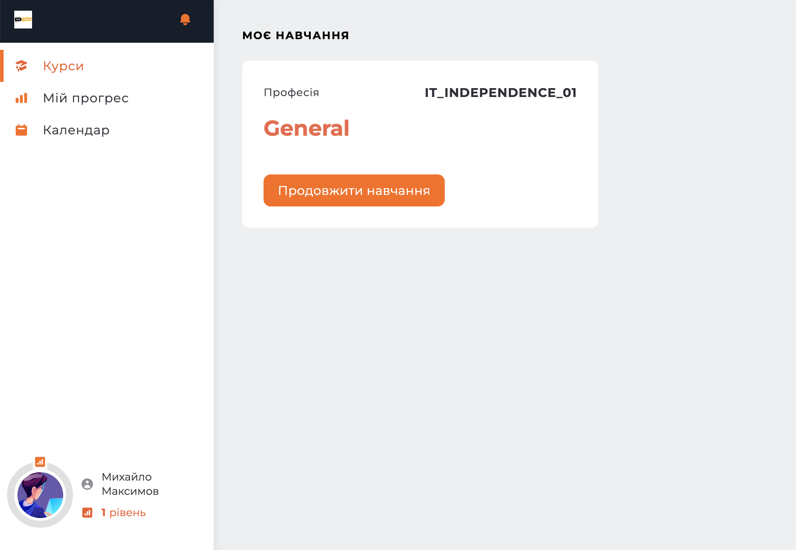
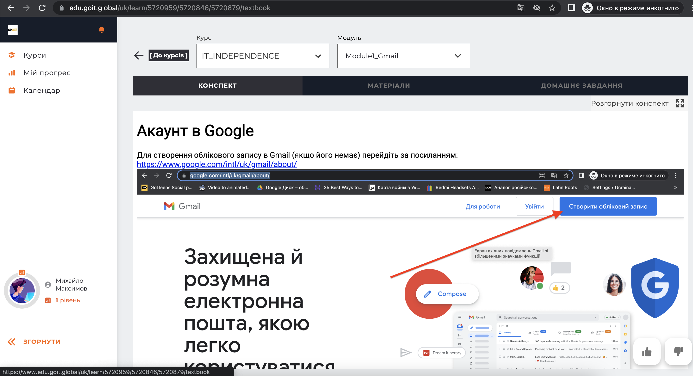
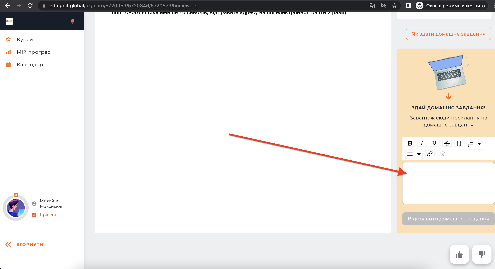

# LMS
## Перехід за посиалнням
Даємо клієнтам посилання для підключення на курс: https://www.edu.goit.global/uk/account/signup?stream=itindependence&tel=1&locale=uk   
Після натискання на посилання клієнт переходить на сторінку реєстрації:  

  
Заповнює свої дані:  
  

## Вхід до LMS
Після реєстрації клієнт попадає на головну сторінку де бачить всі доступні курси (зараз - лише IT-independence):  
  

## Курс
В матеріалах курса клієнт побачить:
- Підручник:  
  

- Матеріали курсу (відео):  
 

- Домашнє завдання 
  

- Форму для відправлення виконаного домашнього завдання:  
  
